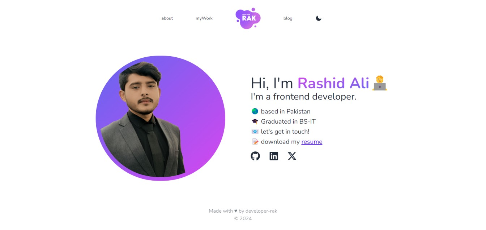
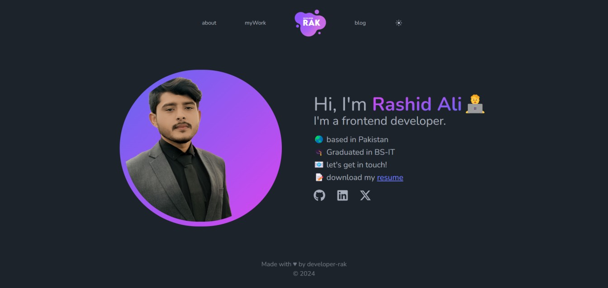

# 🧑‍💻 Personal Portfolio (24.9.20)

### _Personal portfolio built using Next, react, typescript, tailwind and libraries, Hope you like it, tweak it and use it !!_

### Link :link: https://developer-rak.netlify.app/

## Images




## Responsive


## Run Locally

  - Run This command `https://github.com/developer-rak/new-developer-rak.git`
  - You are now in the dev environment and you can play around

## ⚙️ Tech Stack/Framework
  - HTML5
  - CSS3
  - Next
  - Next-themes
  - React
  - React-icons
  - node
  - daisyui
  - eslint
  - postcss
  - tailwindcss
  - typescript
  - Netlify


This is a [Next.js](https://nextjs.org/) project bootstrapped with [`create-next-app`](https://github.com/vercel/next.js/tree/canary/packages/create-next-app).

## Getting Started

First, run the development server:

```bash
npm run dev
# or
yarn dev
# or
pnpm dev
# or
bun dev
```

Open [http://localhost:3000](http://localhost:3000) with your browser to see the result.

You can start editing the page by modifying `app/page.tsx`. The page auto-updates as you edit the file.

This project uses [`next/font`](https://nextjs.org/docs/basic-features/font-optimization) to automatically optimize and load Inter, a custom Google Font.

## Learn More

To learn more about Next.js, take a look at the following resources:

- [Next.js Documentation](https://nextjs.org/docs) - learn about Next.js features and API.
- [Learn Next.js](https://nextjs.org/learn) - an interactive Next.js tutorial.

You can check out [the Next.js GitHub repository](https://github.com/netlify/next.js/) - your feedback and contributions are welcome!

## Deploy on Netlify

The easiest way to deploy your Next.js app is to use the [Netlify Platform](https://app.netlify.com/teams/developer-rak/sites?page=1) from the creators of Next.js.

Check out our [Next.js deployment documentation](https://nextjs.org/docs/deployment) for more details.
